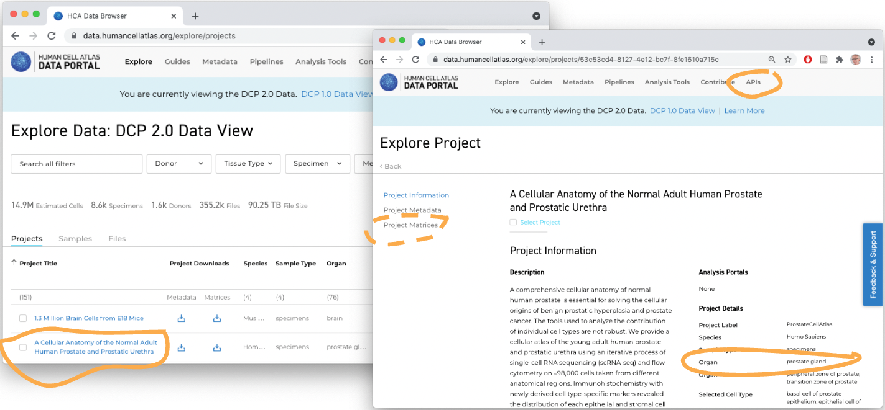

```{r, include = FALSE}
knitr::opts_chunk$set(collapse = TRUE)
```

We use the following packages during this section of the workshop.

```{r setup, message = FALSE}
## package developed for this workshop
library(HCABiocTraining)

## general programming tools
library(dplyr)

## data access
library(hca)
library(cellxgenedp)

## single cell data representation in R
library(SingleCellExperiment) # Bioconductor representation
library(Seurat)               # Seurat representation
```

# Data Transformations

FASTQ files

- DNA sequences and quality scores
- Very large
- Processed e.g., by CellRanger or other software
- Quality control, summary to count matrix (below)

Count matrix

- Usually genes (rows) x cells (columns)
- Can be large (e.g., 30,000 genes x 50,000 cells)
- Usually *very* sparse, e.g., 95% of cells '0'.
- Still large enough to require a decent amount of computing power,
  e.g., 32 GB RAM, 8 CPU for some steps.
- Common formats

  - CSV file -- lots of zero's so very wasteful of space.
  - 'Matrix Market' sparse matrix files, e.g., tuples of <row, column,
    count> for non-zero values.
  - HDF5, e.g., [.loom][] or `.h5ad` ([anndata][]).

- Representation in _R_

  - In-memory sparse matrices: `dgCMatrix` class from the Matrix package
  - On-disk representation via *Bioconductor*'s [DelayedArray][] /
    [HDF5Array][].

Counts & annotations

- CSV and Matrix Market files store just counts; usually annotations
  on columns (e.g., what sample did each cell come from?) are stored
  separately.
- HDF5 file formats coordinate row and column annotations with count
  data.
- *R* software tries to offer a coordinated representation of counts
  and metadata, e.g., *Bioconductor*'s [SingleCellExperiment][].

[anndata]: https://anndata.readthedocs.io/en/latest/index.html
[.loom]: https://linnarssonlab.org/loompy/format/index.html
[DelayedArray]: https://bioconductor.org/packages/DelayedArray
[HDF5Array]: https://bioconductor.org/packages/HDF5Array

# Data Discovery

## Human Cell Atlas

[Data portal][HCA-portal]



What's available?

- Project & sample annotations for HCA-funded projects
- FASTQ files
- 'Legacy' `.loom` files for about 50 experiments
- *Ad hoc* count matrix data -- mostly CSV or Matrix Market files --
  easy to download, but...
- Count matrix data have uncertain provenance (how were they
  computed?). Often considerable work required to create usable data,
  e.g., [hcaCaseStudies][]

## CellXGene

[Data Portal][CXG-portal]


What's available?

- Collections and datasets contributed by the single-cell community,
  with some overlap with data sets in the HCA Data Portal.
- FASTQ files
- `.h5ad`-summarized count data and cell metadata, as well as
  reduced-dimension (e.g., UMAP) representations
- Summarized count files provided by the contributor / individual lab,
  so of uncertain provenance
- Easy to download count matrix, e.g., in `.h5ad` (anndata) format
- Easy to visualize (!)


[HCA-portal]: https://data.humancellatlas.org/
[CXG-portal]: https://cellxgene.cziscience.com/datasets

# Programatic Discovery

Why use an *R* script when the Data Portals exist?

- Easily reproducible
- Flexible exploration of rich & complex data
- Direct integration with _Bioconductor_ single-cell workflows

## Human Cell Atlas

- See the [ExploratingHCACxG workshop][A-HCA] on HCA data retrieval
  for retrieving legacy `.loom` files.
  
- See [hcaCaseStudies][] for examples of processing CSV and Matrix
  Market files.

[A-HCA]: https://mtmorgan.github.io/ExploringHCACxG/articles/A_HCA.html
[hcaCaseStudies]: https://mtmorgan.github.io/hcaCaseStudies

## CellXGene

Load the [cellxgenedp][] package

```{r}
library(cellxgenedp)
```

Retrieve the current database, and use 'tidy' functionality to mimic
the graphical selection in the web browser -- 10x 3' v3 (EFO:0009922)
assay, Affrican American ethnicity, female gender)

```{r}
db <- db()
african_american_female <-
    datasets(db) |>
    dplyr::filter(
        facets_filter(assay, "ontology_term_id", "EFO:0009922"),
        facets_filter(self_reported_ethnicity, "label", "African American"),
        facets_filter(sex, "label", "female")
    )
african_american_female
```

'Join' selected datasets and files to identify the files associated
with these datasets.

```{r}
selected_files <-
    left_join(
        african_american_female |> select(dataset_id),
        files(db),
        by = "dataset_id"
    )
selected_files
```

Select the first 'CXG' file available in this subset of data; for
reproducibility we retrieve the dataset id...

```{r}
selected_files |>
    dplyr::filter(filetype == "CXG") |>
    dplyr::slice(1) |>
    pull(dataset_id)
## "de985818-285f-4f59-9dbd-d74968fddba3"
```

... and set it; the helper function `training_cxg_dataset()` provides
a summary of this dataset.

```{r}
dataset <- "de985818-285f-4f59-9dbd-d74968fddba3"
training_cxg_dataset(dataset)
```

Visualize this 'CXG' file in the browser...

```{r}
selected_files |>
    dplyr::filter(filetype == "CXG", dataset_id == dataset) |>
    datasets_visualize()
```

...or select the 'H5AD' or 'RDS' (Seurat) file associated with the
dataset and download it for subsequent processing in _R_

```{r}
seurat_file <-
    selected_files |>
    dplyr::filter(filetype == "RDS", dataset_id == dataset) |>
    files_download(dry.run = FALSE)

h5ad_file <-
    selected_files |>
    dplyr::filter(filetype == "H5AD", dataset_id == dataset) |>
    files_download(dry.run = FALSE)
```

The downloaded file is cached, so the next time access is fast.

# Representation in *R*

## *Seurat*

Fortunately, CELLxGENE distributes Seurat (v. 4) files, and they can
be input directly.

```{r}
library(Seurat)
seurat <- readRDS(seurat_file)
seurat
```

We will work with this object a little in a subsequent article.

The `.h5ad` files from CELLxGENE can also be used to construct a
`Seurat` object. Normally, a `Seurat` object can be created using
[SeuratDisk][] using this [workflow][SeuratDisk-workflow]

```{r, eval = FALSE}
h5seurat_file <- sub(".h5ad$", "h5seurat", h5ad_file)
Convert(h5ad_file, dest = "h5seurat", overwrite = TRUE)
h5seurat <- LoadH5Seurat(h5seurat_file)
```

Unfortunately this does not currently handle the `.h5ad` file format
made available by CELLxGENE. The helper function
`training_read_h5ad_as_seurat()` sketches an approach to data import
using the [anndata][] *R* package and [anndata][anndata-python]
module.

## *SingleCellExperiment*

The `SingleCellExperiment` is used to represent 'rectangular' single
cell expression and other data in _R_ / _Bioconductor_. It coordinates
a gene x cell count matricies (`assay()`) with annotations on the
genes (`rowData()`) and columns (`cellData()`), and with
reduced-dimension summaries.

Usually, an effective way to represent the `.h5ad` data as a
`SingleCellExperiment` is using `zellkonverter::readH5AD()`. Recent
updates to the `.h5ad` file format have unfortunately broken that
function; it will likely be fixed in a timely manner. Instead, we use
the helper function `training_read_h5ad_as_sce()` to load the data

```{r}
h5ad <- training_read_h5ad_as_sce(h5ad_file)
```

The approach uses the [anndata][] *R* package and
[anndata][anndata-python] module.  Displaying the object...

```{r}
h5ad
```

...suggests the data available and how to access it -- there are `r
nrow(h5ad)` genes and `r ncol(h5ad)` cells. The 'raw' data include
counts `assays(h5ad, "counts")`, annotations on each gene
(`rowData()`) and cell (`colData()`), etc...

Working with `SingleCellExperiment` objects is described in additional
detail subsequent articles.

[SingleCellExperiment]: https://bioconductor.org/packages/SingleCellExperiment
[Seurat]: https://satijalab.org/seurat/
[SeuratDisk]: https://mojaveazure.github.io/seurat-disk/index.html
[SeuratDisk-workflow]: https://mojaveazure.github.io/seurat-disk/articles/convert-anndata.html#converting-from-anndata-to-seurat-via-h5seuratbut this

[anndata]: https://cran.r-project.org/package=anndata
[anndata-python]: https://anndata.readthedocs.io/en/latest/index.html
